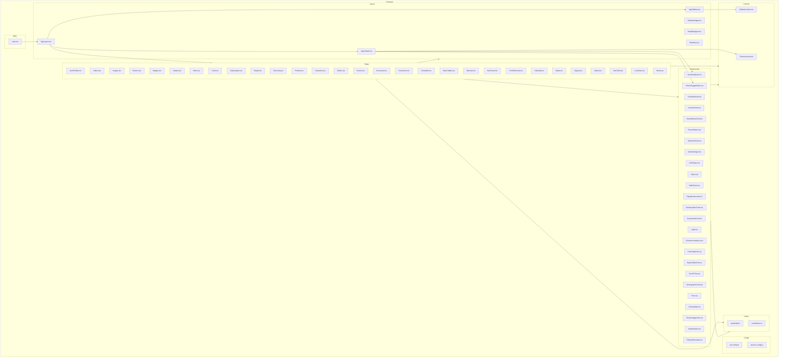

    

    <b>Automatic Architecture Diagrams from Code</b> 
    <a href="https://github.com/swark-io/swark">GitHub</a> • <a href="https://swark.io">Website</a> • <a href="mailto:contact@swark.io">Contact Us</a>

## Usage Instructions

1. **Render the Diagram**: Use the links below to open it in Mermaid Live Editor, or install the [Mermaid Support](https://marketplace.visualstudio.com/items?itemName=bierner.markdown-mermaid) extension.
2. **Recommended Model**: If available for you, use `claude-3.5-sonnet` [language model](vscode://settings/swark.languageModel). It can process more files and generates better diagrams.
3. **Iterate for Best Results**: Language models are non-deterministic. Generate the diagram multiple times and choose the best result.

## Generated Content
**Model**: GPT-4o - [Change Model](vscode://settings/swark.languageModel)  
**Mermaid Live Editor**: [View](https://mermaid.live/view#pako:eNqNV9uO0zAQ_ZUqz8AH9AGJvVeiLGIL-0AQcm03NZvYkWMvW6323xnfEmecBZ5yZs6JnfFc3D5XVDFerataNpr0x9Xuopar1WD3wbzSShoumXNm7s-k4UPwrVZfB64_a3UQLR--11VuvjPDU139SMpvgnHlNAEgdtO5VYENALFn1hglHR0R5gkLbweA2A-PxBDt6Igw33JtPO0BYnea0Acg_RNxd3Y_UC16I5QESW4i5RfeE6FBE0DBUqu1kI0XRIw0cKzMUgOKiDBPTh2XPo4EkeJWM-6PIQCcAfmoBOUuBQEh_kJR61YFQYJIcW4Ho7qwxYixRnV9S4RfZsRFNgdBd2TfxpSOVqHTroC9xiPEf1LmSlnJQJAgUlwp3V22PJ1bbuLvJi10AnEZTBB_TUukqxP_xHUiGvm1dxXiwQK7kZHdyDLK8yPRJoTpIVJ8FJInyYiR5gaSAbR7zBjf3qjBXV6UdIeQd_mWG3JONItdnky0j6M28qAyZTIXlB8Y03wYMnHmKXsEPmms4dzE52mIEYMRdEingjxIv4Uxd2xPO6Ib7tQzG2mvtWB3R9K7wxwx3p-33DdqAHg32xoxSjKr6OeGn2lOGNW22_uuzh3LMdxBbY5RF76FXvR5juc_s3GNkT1vXX25J-Iuqeqg1SmHmtBwxiDDrqWZ6nv6VvI0W5O9ODkz8dyBz55q1bY7tVO-3SYLTzPeKV_tgsbokQd_8RHGwk41TcvDFeS-GvsWpkucKsXJW2n0aUt6f-zJeH1Pvfut5js6z0JHXWjVM_VbxnZKZhH9gUDhbWRv_eCb2TgKuMs9cflEYF67DGDXPyfKR3JS1kzzjvE90feChX6b2UVdM9LewyI9176kJ7OYk_SBaZ_2BPE93_dxK3fXj0apCp8bRAGXmhtoRB4XCvifp3Cj1MM4Uu3AfTCwQoKwQLYHeK_VWfjtMeJcsjy64Rfbk5lVUPSl8olmcQf5s5i0c8d_3BnyIJq02qMwPHhgJWe8o96aR9irwVCY9UkY7aT99fdQt_DL4edYJmDACh08yk_N3ne61du376csO-9oJCoGv8iFZJfU-LPYA--aX6STf9p58o3Fkb8-JnNaaS5G_uyNKQrPzNMZBSEUz-elUbL5KHnl3XwO1rJ6U8H4h3Qw-HvxXFfGSepqvaorFmZNXb2AyPaMGH4hCOS0q9ZGW_6mItaou5OkydbKNsdqfSDtwF_-AN_CQLw) | [Edit](https://mermaid.live/edit#pako:eNqNV9uO0zAQ_ZUqz8AH9AGJvVeiLGIL-0AQcm03NZvYkWMvW6323xnfEmecBZ5yZs6JnfFc3D5XVDFerataNpr0x9Xuopar1WD3wbzSShoumXNm7s-k4UPwrVZfB64_a3UQLR--11VuvjPDU139SMpvgnHlNAEgdtO5VYENALFn1hglHR0R5gkLbweA2A-PxBDt6Igw33JtPO0BYnea0Acg_RNxd3Y_UC16I5QESW4i5RfeE6FBE0DBUqu1kI0XRIw0cKzMUgOKiDBPTh2XPo4EkeJWM-6PIQCcAfmoBOUuBQEh_kJR61YFQYJIcW4Ho7qwxYixRnV9S4RfZsRFNgdBd2TfxpSOVqHTroC9xiPEf1LmSlnJQJAgUlwp3V22PJ1bbuLvJi10AnEZTBB_TUukqxP_xHUiGvm1dxXiwQK7kZHdyDLK8yPRJoTpIVJ8FJInyYiR5gaSAbR7zBjf3qjBXV6UdIeQd_mWG3JONItdnky0j6M28qAyZTIXlB8Y03wYMnHmKXsEPmms4dzE52mIEYMRdEingjxIv4Uxd2xPO6Ib7tQzG2mvtWB3R9K7wxwx3p-33DdqAHg32xoxSjKr6OeGn2lOGNW22_uuzh3LMdxBbY5RF76FXvR5juc_s3GNkT1vXX25J-Iuqeqg1SmHmtBwxiDDrqWZ6nv6VvI0W5O9ODkz8dyBz55q1bY7tVO-3SYLTzPeKV_tgsbokQd_8RHGwk41TcvDFeS-GvsWpkucKsXJW2n0aUt6f-zJeH1Pvfut5js6z0JHXWjVM_VbxnZKZhH9gUDhbWRv_eCb2TgKuMs9cflEYF67DGDXPyfKR3JS1kzzjvE90feChX6b2UVdM9LewyI9176kJ7OYk_SBaZ_2BPE93_dxK3fXj0apCp8bRAGXmhtoRB4XCvifp3Cj1MM4Uu3AfTCwQoKwQLYHeK_VWfjtMeJcsjy64Rfbk5lVUPSl8olmcQf5s5i0c8d_3BnyIJq02qMwPHhgJWe8o96aR9irwVCY9UkY7aT99fdQt_DL4edYJmDACh08yk_N3ne61du376csO-9oJCoGv8iFZJfU-LPYA--aX6STf9p58o3Fkb8-JnNaaS5G_uyNKQrPzNMZBSEUz-elUbL5KHnl3XwO1rJ6U8H4h3Qw-HvxXFfGSepqvaorFmZNXb2AyPaMGH4hCOS0q9ZGW_6mItaou5OkydbKNsdqfSDtwF_-AN_CQLw)

